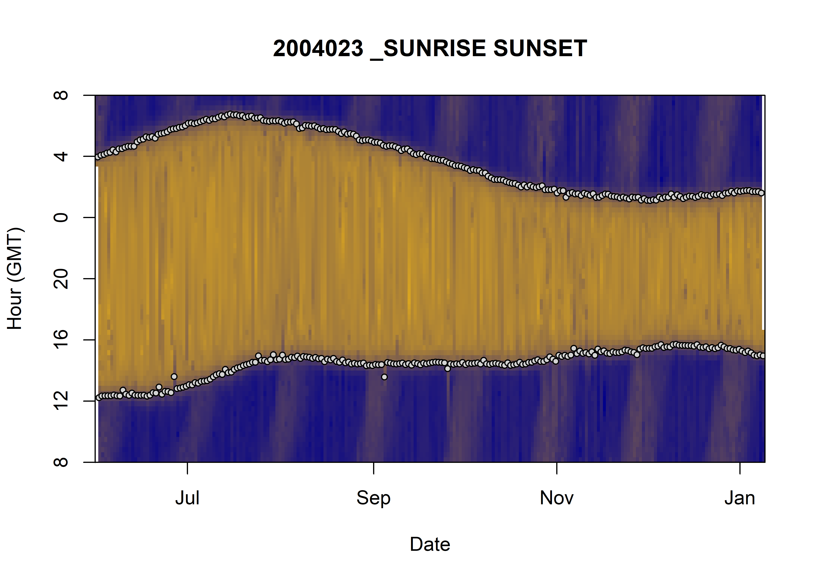

```{r setup, include=FALSE}
# command to build package without getting vignette error
# https://github.com/rstudio/renv/issues/833
# devtools::check(build_args=c("--no-build-vignettes"))

# global option relative to rmarkdown
knitr::opts_chunk$set(echo = TRUE,
                      fig.align = 'center',
                      out.width = "100%",
                      message = FALSE,
                      warning=FALSE)

# library
library(data.table)
library(ggplot2)
library(TwGeos)
library(fpc)

# theme ggplot
# based: https://benjaminlouis-stat.fr/en/blog/2020-05-21-astuces-ggplot-rmarkdown/
theme_jjo <- function(base_size = 12) {
  theme_bw(base_size = base_size) %+replace%
    theme(
      # the whole figure
      #plot.title = element_text(size = rel(1), face = "bold", margin = margin(0,0,5,0), hjust = 0),
      # figure area
      panel.grid.minor = element_blank(),
      panel.border = element_blank(),
      # axes
      #axis.title = element_text(size = rel(0.85), face = "bold"),
      #axis.text = element_text(size = rel(0.70), face = "bold"),
      axis.line = element_line(color = "black", arrow = arrow(length = unit(0.2, "lines"), type = "closed")),
      # legend
      # legend.title = element_text(size = rel(0.85), face = "bold"),
      # legend.text = element_text(size = rel(0.70), face = "bold"),
      # legend.key = element_rect(fill = "transparent", colour = NA),
      # legend.key.size = unit(1.5, "lines"),
      # legend.background = element_rect(fill = "transparent", colour = NA),
      # Les étiquettes dans le cas d'un facetting
      strip.background = element_rect(fill = "#888888", color = "#888888"),
      strip.text = element_text(size = rel(0.85), face = "bold", color = "white", margin = margin(5,0,5,0))
    )
}
```

The idea is to be able to find something similar to what was done for the individual `2004023`, that is to say find the different phase of the day : day, night, sunrise, sunset. For that we'll try the function previously used in `2004023` and try to apply the same function to 2018-individual. Then we'll try other methods. Our goal is to be able to plot this kind of figure:



# Display the data of 2018-individuals

Let's first load our package and our data.

```{r}
# load library
library(weanlingNES)

# load data
data("data_nes", package = "weanlingNES")

# combine all individuals
data_2018 = rbindlist(data_nes$year_2018, use.name = TRUE, idcol = TRUE)
```

```{r, fig.cap="Visualization of light level at the surface along 2018-indivuals' trip", fig.height=6}
# let's first average `lightatsurf` by individuals, day since departure and hour
dataPlot = data_2018[,.(lightatsurf = median(lightatsurf)), 
                     by=.(.id,day_departure,hour)]

# display the result
ggplot(dataPlot, aes(x = day_departure, y = hour, fill = lightatsurf)) +
  geom_tile() + 
  facet_grid(.id ~ .)+
  theme_jjo() +
  labs(x = "# of days since departure", y = "Hour", fill = "Light level at surface") +
  theme(legend.position = c("bottom"))
```
Well, the good news is that we can clearly see the same pattern we saw in `2004023`. Let's look at the distribution

```{r, fig.cap="Distribution of `lightatsurf` with a threshold at 110."}
# display the result
ggplot(dataPlot, aes(x = lightatsurf, fill = .id)) +
  geom_histogram(show.legend = FALSE) + 
  geom_vline(xintercept = 110, linetype = "longdash") +
  facet_wrap(.id ~ .)+
  theme_jjo()
```
The distributions show a bimodal distribution, we highlighted the 110-threshold, since it is this threshold that has been used for the individual `2004023`. In our cases, 110 seems to be a good value.


# Let's give a try to the `findTwilights` function

Let's first reshape data to be used with `findTwilights` function.

```{r, fig.cap="Visualization of light level at the surface along 2018-indivuals' trip, with twilight detection point", fig.height=6}
# identification of sunset, sunrise pairs
res_twi = data_2018[!is.na(lightatsurf),
                    findTwilights(.(Date = date, Light = lightatsurf), 
                                  threshold = 110, include=date), by=.id]

# add `day_departure` to res_twi using a rolling join 
# https://www.r-bloggers.com/2016/06/understanding-data-table-rolling-joins/
res_twi = data_2018[,.(.id, Twilight = date, day_departure)
                    ][res_twi, roll=T, on = c(".id","Twilight")]

# hour column
res_twi[, hour := hour(Twilight)]

# display the result
ggplot() +
  geom_tile(data = dataPlot, aes(x = day_departure, y = hour, fill = lightatsurf)) + 
  geom_point(data = res_twi, aes(x = day_departure, y = hour, col = Rise)) +
  facet_grid(.id ~ .)+
  theme_jjo() +
  labs(x = "# of days since departure", 
       y = "Hour", 
       fill = "Light level at surface", 
       col = "Sunrise") +
  theme(legend.position = c("bottom"))
```

Not bad actually! But there are many outliers that need to be addressed. Let try to keep only the couple `Rise` (`TRUE`, `FALSE`) that have the longer period of time of the day.

```{r}
# calculate the period of time between a sunrise and a sunset (two rows)
res_twi[, period_time := c(0,as.numeric(diff(Twilight))), 
        by= .(.id, as.Date(Twilight))]

# keep only the longer period of time and the row just before
res_twi_inter = res_twi[c(
  # index of row with the longer period of time 
  res_twi[, .I[period_time==max(period_time)], by=.(.id, as.Date(Twilight))]$V1,
  # index of the row previous the one with the longer period of time  
    res_twi[, .I[period_time==max(period_time)], by=.(.id, as.Date(Twilight))]$V1-1)
  # reorder by date
  ][order(Twilight)]
```

```{r, fig.cap="Visualization of light level at the surface along 2018-indivuals' trip, with twilight detection point corrected", fig.height=6}
# display the result
ggplot() +
  geom_tile(data = dataPlot, aes(x = day_departure, y = hour, fill = lightatsurf)) + 
  geom_point(data = res_twi_inter, aes(x = day_departure, y = hour, col = Rise)) +
  facet_grid(.id ~ .)+
  theme_jjo() +
  labs(x = "# of days since departure", 
       y = "Hour", 
       fill = "Light level at surface", 
       col = "Sunrise") +
  theme(legend.position = c("bottom"))
```

That's definitely better, but there are few remaining outliers (especially for the individual `ind_2018074`). Let's zoom in the first days since departure for this individual.

```{r, fig.cap="Visualization of light level at the surface for the first 100 days of `ind_2018074`, with twilight detection point corrected"}
# display the result
ggplot() +
  geom_tile(data = dataPlot[.id == "ind_2018074" & day_departure < 100,], aes(x = day_departure, y = hour, fill = lightatsurf)) + 
  geom_point(data = res_twi_inter[.id == "ind_2018074" & day_departure < 100], aes(x = day_departure, y = hour, col = Rise)) +
  theme_jjo() +
  labs(x = "# of days since departure", 
       y = "Hour", 
       fill = "Light level at surface", 
       col = "Sunrise") +
  theme(legend.position = c("top"))
```

As we can see, some low light level are encountered in the middle of daytime that mislead the `findTwilight` function. 

Since those points are due to outliers during the day, we could try to smooth the light level signal and run the `findTwilight` function on it.

```{r}
# # let's first split our dataset by individual
# split_inter = split(data_2018, data_2018$.id)
# 
# # create a times series of ligth level
# split_inter = lapply(split_inter, function(x) {
#   # summerize data at the min level
#   df = x[,.(lightatsurf = median(lightatsurf, na.rm=T)), by=.(date = floor_date(date, unit="min"))]
#   # creation of a time series
#   z = as.ts(zoo(df$lightatsurf, df$date))
#   # smoother creation
#   # https://boostedml.com/2020/05/an-introduction-to-time-series-smoothing-in-r.html
#   s = ksmooth(time(z),as.numeric(z),'normal',bandwidth=6)
#   # retrieve smooth value
#   x[, lightatsurf_smooth := s$y]
# })
# 
# # unlist
# data_2018 = rbindlist(split_inter)
```

> So far, I have not been successful using this method cause it seems to be quiet tricky to smooth a signal with a lot of missing values.


# Let's try a clustering method

Since we can visually see where is the day and night time, we should try clustering method.

## K-MEANS +  Hierarchical clustering

Here we test a package well-known to perform clustering `FactoMineR`. The idea behind its main method is to performed a hierarchical clustering where the initial centroids are positioned based on a pre-performed k-means using the first component of a PCA. For more information feel free to have a look at their [website](http://factominer.free.fr/factomethods/hierarchical-clustering-on-principal-components.html).

```{r, cahce=TRUE, fig.cap="Visualization of the moment where the light was measured at the surface colored with the associated cluster (HCPC)", fig.height=6}
# remove nan value
df_clust = dataPlot[!is.na(lightatsurf),.(hour,day_departure,lightatsurf)]
                    
# HCPC with onlys 2 groups
res_hcpc = FactoMineR::HCPC(df_clust, nb.clust = 2, graph = FALSE)

# display the result
ggplot() +
  geom_tile(data = dataPlot[!is.na(lightatsurf),
                            ][,cluster:=res_hcpc$data.clust$clust], 
            aes(x = day_departure, y = hour, fill = factor(cluster))) + 
  theme_jjo() +
  facet_grid(.id ~ .)+
  labs(x = "# of days since departure", 
       y = "Hour", 
       fill = "cluster", 
       col = "Sunrise") +
  theme(legend.position = c("bottom"))
```
Well, clearly this algorithm is not suited to deal with this kind of patterns!

## [DBSCAN](https://en.wikipedia.org/wiki/DBSCAN)

DBSCAN seems to be an [elegant](http://www.sthda.com/english/wiki/wiki.php?id_contents=7940) algorithm to deal with outliers and non-convex cluster. The only **issue** is that we have to choose the right value for its two parameters:

* Reachability distance
* Reachability minimum number of points

Which might be tricky!

```{r dbscan_first_test, fig.cap="Visualization of the moment where the light was measured at the surface colored with the associated cluster (DBSCAN, `eps=45`, `MinPts=nrow(dataPlot)*0.06`)", fig.height=6}
# determine the right values by testing several of them...
res_dbscan = dbscan(df_clust,
            eps = 45,
            MinPts = nrow(dataPlot) * 0.06,
            method = "raw")

# display the result
ggplot() +
  geom_tile(data = dataPlot[!is.na(lightatsurf),
                            ][,cluster:=res_dbscan$cluster],
            aes(x = day_departure, y = hour, fill = factor(cluster))) +
  theme_jjo() +
  facet_grid(.id ~ .)+
  labs(x = "# of days since departure",
       y = "Hour",
       fill = "cluster",
       col = "Sunrise") +
  theme(legend.position = c("bottom"))
```
Well that's quite nice :) There are still few outliers (especially for individual `ind_201874`) identify as cluster 1 whereas we would like to see them in cluster 2. Let's try using other parameters.

```{r, fig.cap="Visualization of the moment where the light was measured at the surface colored with the associated cluster (DBSCAN, `eps=8`, `MinPts=nrow(dataPlot)*0.0001`)", fig.height=6}
# let's try other parameters
res_dbscan = dbscan(df_clust, 
                  eps = 8, 
                  MinPts = nrow(dataPlot)*0.001, 
                  method = "raw")

# display the result
ggplot() +
  geom_tile(data = dataPlot[!is.na(lightatsurf),
                            ][,cluster:=res_dbscan$cluster], 
            aes(x = day_departure, y = hour, fill = factor(cluster))) + 
  theme_jjo() +
  facet_grid(.id ~ .)+
  labs(x = "# of days since departure", 
       y = "Hour", 
       fill = "cluster", 
       col = "Sunrise") +
  theme(legend.position = c("bottom"))

```

Here, the algorithm find several clusters, but it is the cluster `1` that has our attention. It seems better defined than the previous figure \@ref{fig:dbscan_first_test}, but there are still few rows (for `ind_2018074`) that have been mislabelled.

# Conclusion

For now we will used the result from the `DBSCAN` algorithm, since results seem to be better!is
